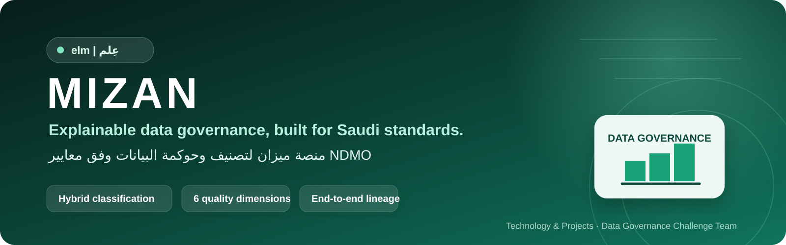
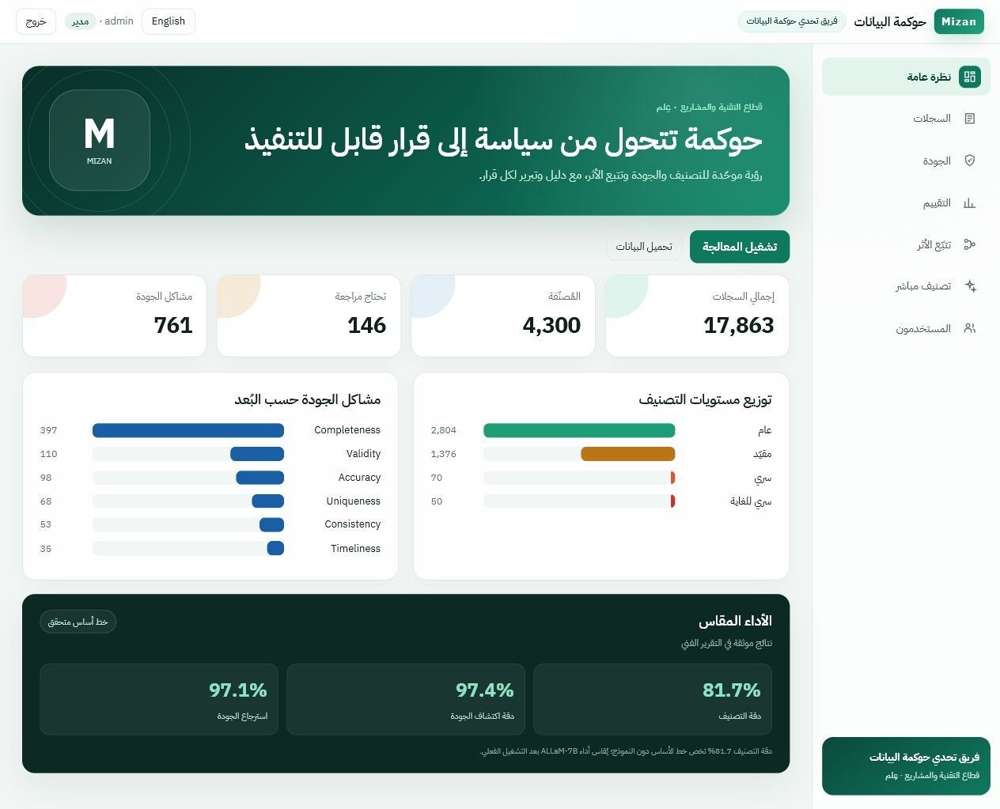
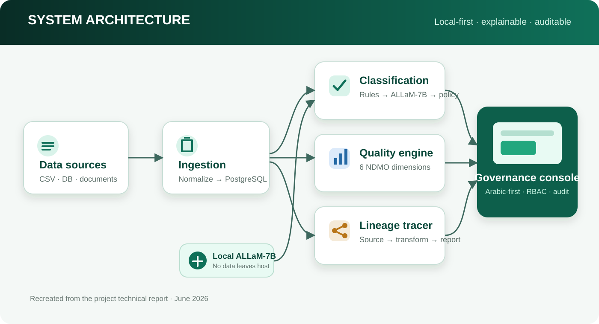
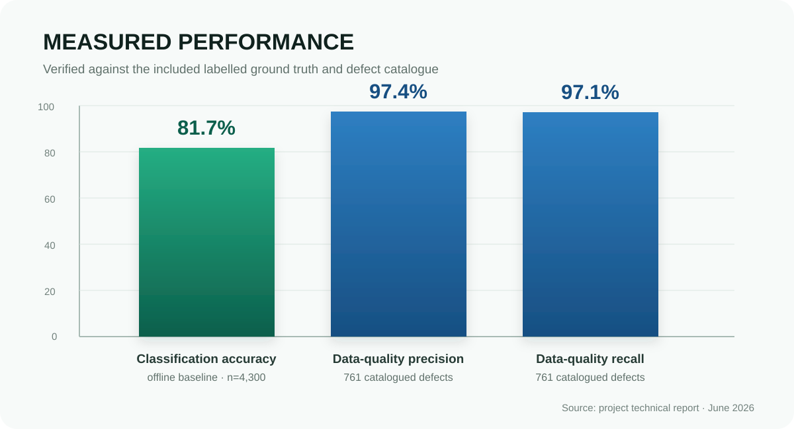
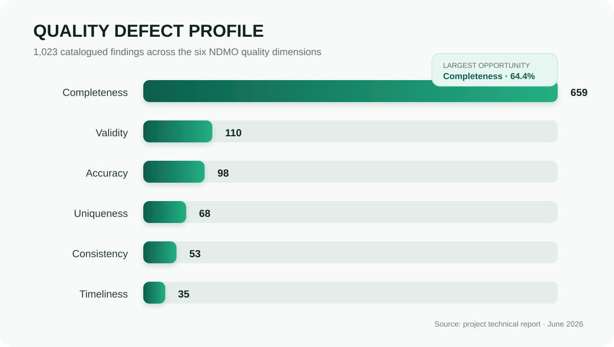
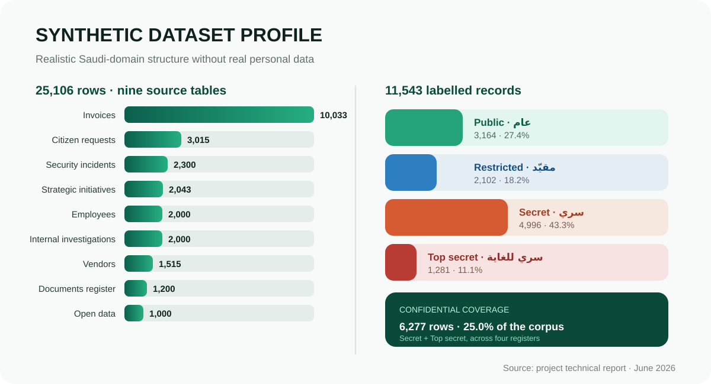

<p align="center">
  
</p>

<p align="center">
  <strong>مشروع فريق تحدي حوكمة البيانات في قطاع التقنية والمشاريع لدى عِلم (Elm)</strong><br />
  منصة عربية أولًا لتحويل متطلبات NDMO إلى قرارات تصنيف وجودة وأثر قابلة للتفسير والتدقيق.
</p>

<p align="center">
  
  
  
  
  
  
</p>

<p align="center"><a href="#العربية">العربية</a> · <a href="#english">English</a></p>

---

<a id="العربية"></a>

## ميزان في سطر واحد

**ميزان** منصة حوكمة بيانات متكاملة بُنيت لمشروع تحدي حوكمة البيانات لدى **عِلم - قطاع التقنية والمشاريع**. تستوعب البيانات، تصنّف حساسيتها وفق مستويات NDMO الأربعة، تقيس أبعاد الجودة الستة، وتتتبّع الأثر من المصدر إلى التقرير - مع صلاحيات وصول وسجل تدقيق وتشغيل محلي للنموذج.

> كل البيانات المرفقة اصطناعية. لا يحتوي المشروع على بيانات شخصية حقيقية، ويعمل النموذج محليًا حتى لا تغادر البيانات بيئة التشغيل.

## من التحدي إلى حل قابل للتشغيل

| التحدي | ما يقدمه ميزان |
|---|---|
| عشوائية التصنيف | مصنّف هجين قائم على الأدلة: قواعد حتمية ← ALLaM-7B محلي ← محرك سياسات |
| الامتثال اليدوي | توصية تحكم، وسم للمراجعة، وتبرير وسجل تدقيق لكل قرار |
| فقدان الأثر | تتبّع بنمط OpenLineage من المصدر إلى المعالجة ثم التقرير |
| ضعف جودة البيانات | محرك يقيس الاكتمال والتفرّد والحداثة والصحة والدقة والاتساق |

## تجربة عربية مصممة لمركز القرار

<p align="center">
  
</p>

الواجهة عربية أولًا (RTL)، ثنائية اللغة، وتعرض المؤشرات والتوزيعات ونتائج التقييم وسلسلة الأثر ضمن تجربة موحّدة. يملك المدير صلاحيات التشغيل والتعديل وإدارة المستخدمين، بينما يحصل المشاهد على وصول للقراءة فقط.

## المعمارية

<p align="center">
  
</p>

أربع ركائز تعمل كخط معالجة واحد: الاستيعاب إلى PostgreSQL، والتصنيف الهجين، ومحرك الجودة، وتتبع الأثر. تُعرض النتائج عبر FastAPI وواجهة ويب محمية بصلاحيات وصول حسب الدور.

## نتائج مقاسة وقابلة لإعادة التحقق

<p align="center">
  
</p>

| المقياس | النتيجة | نطاق القياس |
|---|---:|---|
| دقة التصنيف - النظام الهجين مع `ALLaM-7B` | **93.4%** | 1,800 سجل مصنّف في التشغيل |
| دقة التصنيف - خط الأساس دون النموذج | **85.3%** | 11,543 سجل معنّون |
| دقة اكتشاف عيوب الجودة | **98.0%** | 1,023 حالة جودة موثقة |
| استرجاع عيوب الجودة | **97.8%** | 1,023 حالة جودة موثقة |

الرقمان مقيسان بتشغيل فعلي لا بتقدير، لكن **نطاقيهما مختلفان**: الهجين يُقاس على السجلات المصنّفة في التشغيل (`--max-per-file 300` أي 300 سجل لكل مصدر)، وخط الأساس دون النموذج يُقاس على كامل مفاتيح الإجابات. تُعاد النتيجتان بتشغيل `pipeline.py` ثم `evaluate.py`.

أثر تشغيل النموذج مركّز في المستوى الأعلى حساسية: استرجاع «سري للغاية» ينتقل من **45.1% إلى 86.5%**، وتنخفض حالات التصنيف الأدنى من الصحيح (خطر التسريب) من 138 إلى 58 دون زيادة في التصنيف الزائد. اختير هذا الإعداد على نصف تطوير وتحقّق على نصف محجوب (93.33% ← 93.57%).

## ماذا تقول البيانات؟

<table>
  <tr>
    <td width="50%"></td>
    <td width="50%"></td>
  </tr>
</table>

- يتصدر **الاكتمال** فرص التحسين بـ659 حالة من أصل 1,023.
- تغطي البيئة **25,106 سجلًا اصطناعيًا** موزعة على تسعة مصادر واقعية البنية.
- تتضمن مفاتيح الإجابات 11,543 سجلًا معنّونًا لتقييم التصنيف آليًا.
- تمثّل السجلات المصنّفة **سري** و**سري للغاية** معًا **25.0%** من إجمالي الصفوف (6,277 سجلًا)، بواقع 4,996 «سري» و1,281 «سري للغاية».

## كيف يعمل التصنيف؟

1. **قواعد وأنماط حتمية:** الهوية الوطنية عبر Luhn، الآيبان عبر mod-97، الجوال، الرقم الضريبي، ومعجم أعمدة عربي/إنجليزي.
2. **نموذج محلي:** ALLaM-7B يعالج النص الحر والحالات الغامضة دون إرسال البيانات إلى خدمة خارجية.
3. **شبكة أمان بالكلمات المفتاحية:** معجم عربي حتمي يعمل دائمًا، لكن صلاحيته محصورة في *رفع* التصنيف إلى «سري للغاية» فقط - وهو المستوى الوحيد الذي يقلّل النموذج من شأنه. توسيع صلاحيتها إلى بقية المستويات يخفض الدقة الكلية إلى 77%.
4. **محرك سياسات:** يطبق المستوى الأعلى عند التجميع، ويستخدم «مقيّد» كافتراضي آمن، ويحدد الحالات التي تحتاج مراجعة.

كل قرار يعيد المستوى، والثقة، والدليل، والتبرير، وطريقة اتخاذ القرار.

## التشغيل السريع

```bash
cp .env.example .env
docker compose up -d --build
```

افتح `http://localhost:8000` ثم استخدم أحد الحسابين التجريبيين:

| الدور | بيانات الدخول | الصلاحيات |
|---|---|---|
| مدير | `admin / admin123` | تشغيل المعالجة، التعديل، إدارة المستخدمين، وصول كامل |
| مشاهد | `viewer / viewer123` | قراءة السجلات والجودة والأثر والتقييم |

شغّل خط المعالجة والتقييم:

```bash
docker compose exec app python pipeline.py --max-per-file 300
docker compose exec app python evaluate.py
```

> غيّر `JWT_SECRET` و`ADMIN_PASSWORD` في `.env` قبل أي استخدام غير تجريبي.

## المكدس التقني

`FastAPI` · `PostgreSQL 16` · `SQLAlchemy` · `Ollama / ALLaM-7B` · `Docker Compose` · `Python` · واجهة `HTML/CSS/JS` عربية مخصصة

---

<a id="english"></a>

## English

**Mizan** is an Arabic-first data-governance platform created for the **Elm Data Governance Challenge team within Technology & Projects**. It turns NDMO requirements into explainable classification, measurable data quality, traceable lineage, and role-controlled actions.

### Core capabilities

- **Explainable classification:** deterministic Saudi identifier checks → local ALLaM-7B → policy enforcement.
- **NDMO data quality:** completeness, uniqueness, timeliness, validity, accuracy, and consistency.
- **End-to-end lineage:** source → transform → report, with highest-sensitivity inheritance.
- **Governed access:** Admin and Viewer roles, token authentication, and an append-only audit log.
- **Local-first AI:** the model runs on the host; project datasets are synthetic.

### Verified baseline

The included answer keys make evaluation reproducible: **93.4% hybrid classification accuracy** with ALLaM-7B live (n=1,800 records classified in the run), **85.3% offline classification accuracy** (n=11,543), **98.0% data-quality precision**, and **97.8% data-quality recall** (1,023 catalogued defects). Note the two classification figures use different denominators — the hybrid score covers the rows classified under `--max-per-file 300`, the offline baseline covers the full answer key.

The model's contribution is concentrated in the most sensitive level: Top-secret recall moves from **45.1% to 86.5%**, and under-classifications (the leak-risk direction) fall from 138 to 58 with no increase in over-classification. The configuration was selected on a dev half and validated on a held-out half (93.33% → 93.57%).

The corpus is deliberately balanced for sensitivity: **Secret + Top secret = 25.0% of all 25,106 rows** (6,277 records), spread across the documents register and three classified registers — security incidents, internal investigations, and pre-disclosure strategic initiatives. Roughly 12% of the confidential records carry no level keyword at all, so the offline baseline falls back to NDMO's safe default (مقيّد) and only the LLM layer can resolve them.

### Repository map

```text
app/        FastAPI API, classification, quality, lineage, ingestion, auth, bilingual UI
data/       Synthetic datasets and evaluation answer keys
scripts/    Corpus expansion + Postgres seed regeneration
db/         PostgreSQL bootstrap seed
docs/       Project visuals recreated from the June 2026 technical report
prompts/    NDMO system prompt
ollama/     Local model definition
```

### Quick start

```bash
cp .env.example .env
docker compose up -d --build
docker compose exec app python pipeline.py --max-per-file 300
docker compose exec app python evaluate.py
```

Open `http://localhost:8000`. Demo credentials are `admin / admin123` and `viewer / viewer123`; replace all demo secrets before real use.
